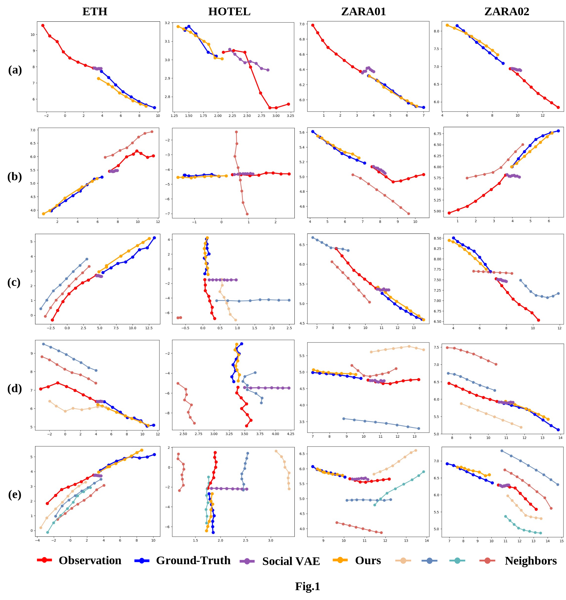
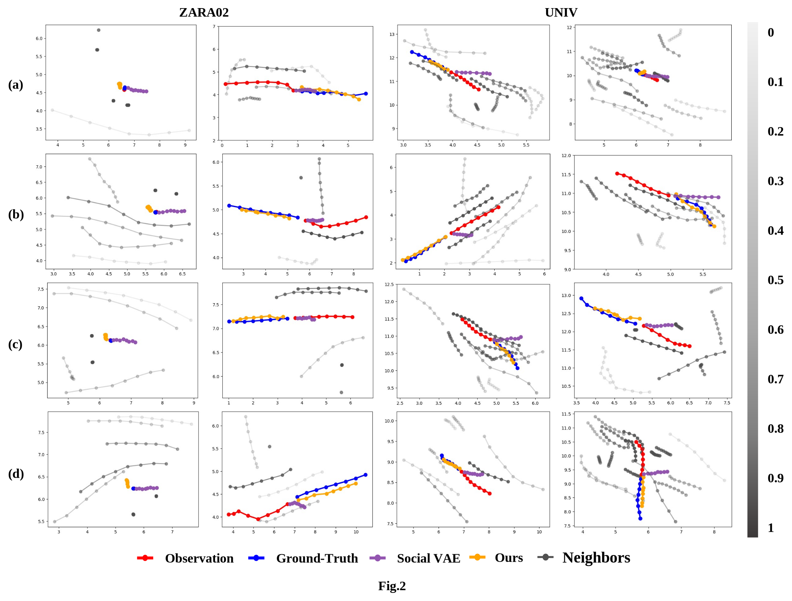
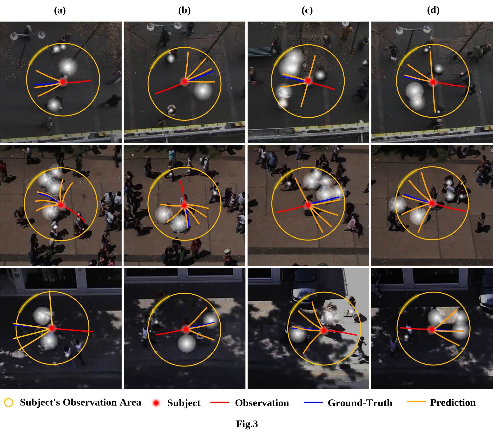

# SocialTrans: Transformer-Based Social Intentions Interaction for Pedestrian Trajectory Prediction

_**Abstract**_ -- The prediction of pedestrian trajectories plays a crucial role in practical traffic scenarios. However, current methodologies have shortcomings, such as overlooking pedestrians' perception of motion information from neighbor groups, employing simplistic and fixed social state interaction models, and lacking in final position correction. To address these issues, SocialTrans is proposed. It utilizes global observations to model the motion states of pedestrians and their neighbors, constructing separate state tensors to encapsulate social interaction information between them. This design includes a Subject Intention Extraction Module and a Neighbor Perception Intentions Extraction Module, which operate in parallel throughout the observation period to facilitate deep interaction of social states rather than simple end-to-end external fusion. Furthermore, a trajectory prediction optimizer is developed to correct final position predictions and simulate pedestrian motion diversity through trajectory clustering. Experimental validation is conducted on the ETH/UCY and SDD public datasets to evaluate the effectiveness of the proposed approach. The results demonstrate the method's capability to learn historical trajectory information, achieve high-precision predictions, and achieve state-of-the-art performance, particularly outperforming existing SOTA models on the SDD dataset.

_**Visualisation**_--Our approach is tested on the public datasets ETH, UCY, and SDD. As shown in Fig. 1, the results of trajectory prediction for simple scenarios are demonstrated for the agent itself, as well as for neighbours increasing sequentially from 1 to 4. As shown in Fig. 2, a scenario with richer social information and larger number of pedestrians is demonstrated, where neighbours are represented by grey trajectories and the attention score is characterised by its transparency, with lower transparency representing a higher attention score and higher transparency representing a lower attention score. As shown in Fig. 3, it is the attention graph in the observation range, where the first line is HOTEL, the second line is UNIV, and the third line is ZARA. the yellow circle is the observation area of the agent, the red dot is the position of the agent itself in the current scene, the red line segment indicates the historical trajectory of the agent in the current scene, the blue line segment indicates the real trajectory, and the orange line segment indicates the predicted trajectory.

## Environment
- Ubuntu 18.04
- Python 3.7.4
- cudnn 8.0.5
- Pytorch 1.11 + cu111
- Numpy 1.21

We recommend to install all the requirements through Conda by

    $ conda create --name <env> --file requirements.txt -c pytorch -c conda-forge

## Code Usage

Command to train a model from scratch:

    $ python socialtrans_train.py --train <train_data_dir> --test <test_data_dir> --ckpt <checkpoint_dir> --config <config_file>

Training and testing data are provided in `data` folder and the configuration files are in `config` folder. 
You can run them to see the results.

    # ETH/UCY
    $ python socialtrans_train.py --train data/eth/train --test data/eth/test --config config/eth.py
    $ python socialtrans_train.py --train data/hotel/train --test data/hotel/test --config config/hotel.py
    $ python socialtrans_train.py --train data/univ/train --test data/univ/test --config config/univ.py
    $ python socialtrans_train.py --train data/zara01/train --test data/zara01/test --config config/zara01.py
    $ python socialtrans_train.py --train data/zara02/train --test data/zara02/test --config config/zara02.py

    # SDD
    $ python socialtrans_train.py --train data/sdd/train --test data/sdd/test --config config/sdd.py

## Pre-trained Models and Evaluation
Download pre-trained models from: https://pan.baidu.com/s/1OoNBt1iMxCaoMU0h0mSvew. code: 4k9.
Put them in the main directory and change the code in socialtrans_test.py that corresponds to the loading model section

    # ETH/UCY benchmarks
    $ python socialtrans_test.py --test data/eth/test  --config config/eth.py
    $ python socialtrans_test.py --test data/hotel/test  --config config/hotel.py
    $ python socialtrans_test.py --test data/univ/test  --config config/univ.py
    $ python socialtrans_test.py --test data/zara01/test --config config/zara01.py
    $ python socialtrans_test.py --test data/zara02/test --config config/zara02.py

    # SDD benchmark
    $ python socialtrans_test.py --test data/sdd/test --config config/sdd_pixel.py

 

## Training New Models

### Prepare your own dataset

Our code supports loading trajectories from multiple files, each representing a scene. Simply split your data into training and testing sets, and save each scene as a `txt` file in the corresponding folder.

Each line in the data files should follow this format:

    frame_ID:int  agent_ID:int  pos_x:float  pos_y:float  group:str

- `frame_ID` and `agent_ID` are integers 
- `pos_x` and `pos_y` are float numbers. 
- The `group` field is optional and can be used to identify the agent type/group. This allows the model to be trained to predict the movements of specific groups/types of agents.

### Setup your config file

We provide our config files in `config` folder, which can be used as reference.

A key hyperparameter that needs to pay attention is `PERCEP_RADIUS`. In a common scenario with causal human walking, it can be values from 2 to 5. 

### Training

    $ python socialtrans_train.py --train <folder_of_training_data> --test <folder_of_testing_data>  --config <config_file>

### Evaluation

    $ python socialtrans_test.py --test <folder_of_testing_data>  --config <config_file>

